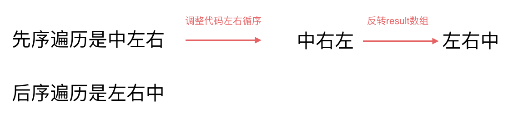

# 二叉树的迭代遍历 interation

非递归的方式遍历二叉树 ： 迭代 Interation

### 前序遍历（迭代法）

我们先看一下前序遍历。

前序遍历是中左右，每次先处理的是中间节点，那么先将根节点放入栈中，然后将右孩子加入栈，再加入左孩子。

为什么要先加入 右孩子，再加入左孩子呢？ 因为这样出栈的时候才是中左右的顺序。


每个中间节点做一次迭代，每一层是这样操作的。

	1. 根节点 5， 入栈， 出栈
 	2. 根节点 5 的右孩子 6 入栈， 左孩子 4 入栈， 左孩子 4 出栈
 	3. 根节点5 的右孩子没有子节点，看左孩子，左孩子的右孩子 2 入栈， 左孩子的左孩子 1 入栈。然后 1 出栈， 2出栈。 6出栈。

代码如下：

```cpp
class Solution {
public:
	vector<int> preorderTraversal(TreeNode* root) {
        stack<TreeNode*> st;
        vector<int> result;
        if (root == NULL) return result;
        st.push(root);
        while(!st.empty()) {
            TreeNode* node = st.top();				// 中
            st.pop();
            result.push_back(node->val);
            if (node->right) st.push(node->right);	//右 （空节点不入栈）
            if (node->left) st.push(node->left);	//左 （空节点不入栈）
        }
        return result;
    }
}
```

### 中序遍历（迭代法）

为了解释清楚，我说明一下 刚刚在迭代的过程中，其实我们有两个操作：

1. **处理：将元素放进result数组中**
2. **访问：遍历节点**

分析一下为什么刚刚写的前序遍历的代码，不能和中序遍历通用呢，因为前序遍历的顺序是中左右，先访问的元素是中间节点，要处理的元素也是中间节点，所以刚刚才能写出相对简洁的代码，**因为要访问的元素和要处理的元素顺序是一致的，都是中间节点。**

那么再看看中序遍历，中序遍历是左中右，先访问的是二叉树顶部的节点，然后一层一层向下访问，直到到达树左面的最底部，再开始处理节点（也就是在把节点的数值放进result数组中），这就造成了**处理顺序和访问顺序是不一致的。**

那么**在使用迭代法写中序遍历，就需要借用指针的遍历来帮助访问节点，栈则用来处理节点上的元素。**

动画如下：


中序遍历（左中右）：

```cpp
class Solution {
public:
	vector<int> inorderTraversal(TreeNode* root) {
        vector<int> result;
        stack<TreeNode*> st;
        TreeNode* cur = root;
        while (cur != NULL || !st.empty()) {
            if (cur != NULL) {	// 指针来访问节点，用while循环访问到最底层
                st.push(cur);	// 将访问的节点放进栈
                cur = cur->left;	// 左
            }
            else {
                cur = st.top();	// 从栈里弹出的数据，就是要处理的数据 (放进result数组里的数据)
                st.pop();
                result.push_back(cur->val);	//中
                cur = cur->right;			//右
            }
        }
        return result;
    }
};
```

### 后序遍历（迭代法）

再来看后序遍历，先序遍历是中左右，后续遍历是左右中，那么我们只需要调整一下先序遍历的代码顺序，就变成中右左的遍历顺序，然后在反转result数组，输出的结果顺序就是左右中了，如下图：



代码如下：

```cpp
class Solution {
public:
    vector<int> postorderTraversal(TreeNode* root) {
        stack<TreeNode*> st;
        vector<int> result;
        if (root == NULL) return result;
        st.push(root);
        while (!st.empty()) {
			TreeNode* node = st.top();
            st.pop();
            result.push_back(node->val);
            if (node->left) st.push(node->left);	//相对于前序遍历，这里更改一下入栈顺序，空节点不入栈
            if (node->right) st.push(node->right);	//空节点不如栈
        }
        reverse(result.begin(), result.end());//将结果反转之后就是左右中的顺序了
        return result;
    }
};
```

## 总结

此时我们用迭代法写出了二叉树的前后中序遍历，大家可以看出前序和中序是完全两种代码风格，并不像递归写法那样代码稍做调整，就可以实现前后中序。

**这是因为前序遍历中访问节点（遍历节点）和处理节点（将元素放进result数组中）可以同步处理，但是中序就无法做到同步！**

上面这句话，可能一些同学不太理解，建议自己亲手用迭代法，先写出来前序，再试试能不能写出中序，就能理解了。

---


迭代法也可以将前中后序用统一风格写出来，但是，不好理解，想看可以看看，这里就先不看了。

https://programmercarl.com/%E4%BA%8C%E5%8F%89%E6%A0%91%E7%9A%84%E7%BB%9F%E4%B8%80%E8%BF%AD%E4%BB%A3%E6%B3%95.html#%E6%80%9D%E8%B7%AF