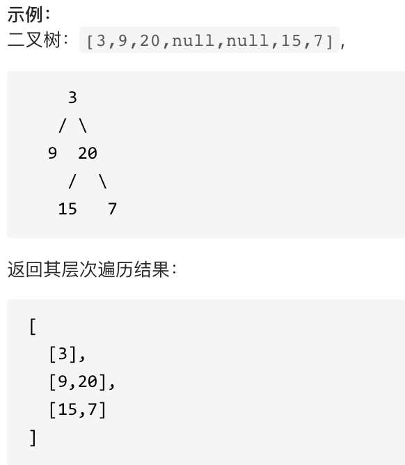

# 二叉树层序遍历

leetcode 102.

[力扣题目链接(opens new window)](https://leetcode.cn/problems/binary-tree-level-order-traversal/)

给你一个二叉树，请你返回其按 **层序遍历** 得到的节点值。 （即逐层地，从左到右访问所有节点）。



二叉树的另一种遍历方式： 层序遍历。

即： 从左到右从上到下一层一层的取遍历二叉树。

这里就不能用栈了，而是需要用队列FIFO的特性，符合一层一层遍历的逻辑，而用栈先进后出适合模拟深度有限遍历也就是递归的逻辑。

层序遍历方式就是图论中的广度优先遍历，只不过我们应用在二叉树上。


模板代码如下：

```cpp
class Solution {
public:
    vector<vector<int>> levelOrder(TreeNode* root) {
        queue<TreeNode*> que;
        if (root != NULL) que.push(root);
        vector<vector<int>> result;
        while (!que.empty()) {
            int size = que.size();
            vector<int> vec;
            // 这里一定要使用固定大小size，不要使用que.size()，因为que.size是不断变化的
            for (int i = 0; i < size; i++) {
                TreeNode* node = que.front();
                que.pop();
                vec.push_back(node->val);
                if (node->left) que.push(node->left);
                if (node->right) que.push(node->right);
            }
            result.push_back(vec);
        }
        return result;
    }
};
```

个人更喜欢用  递归法：

```cpp
class Solution {
public:
    void order(TreeNode* cur, vector<vector<int>>& result, int depth) {
        if (cur == nullptr) return;
        if (result.size() == depth) result.push_back(vector<int>());//添加一个空vector
        result[depth].push_back(cur->val);//在添加的空vector里(result[depth]) 添加cur对应的元素
        order(cur->left, result, depth + 1);
        order(cur->right, result, depth + 1);
    }
    vector<vector<int>> levelOrder(TreeNode* root) {
        vector<vector<int>> result;
        int depth = 0;
        order(root, result, depth);
        return result;
    }
};
```

---

---

practice:

leetcode102, 二叉树层序遍历。

https://leetcode.cn/problems/binary-tree-level-order-traversal/description/

```cpp
#include <iostream>
using namespace std;
#include <vector>

struct TreeNode {
	int val;
	TreeNode* left;
	TreeNode* right;
	TreeNode(int x) : val(x), left(NULL), right(NULL) {}
};

class Solution {
public:
	void recursiveFun(TreeNode* cur, vector<vector<int>>& result, int depth) {
		if (cur == nullptr) return;
		if (result.size() == depth) result.push_back(vector<int>());
		result[depth].push_back(cur->val);
		recursiveFun(cur->left, result, depth + 1);
		recursiveFun(cur->right, result, depth + 1);
	}
	vector<vector<int>> levelOrder(TreeNode* root) {
		vector<vector<int>> result;
		int depth = 0;
		recursiveFun(root, result, depth);
		return result;
	}
};

int main() {
	TreeNode* root = new TreeNode(3);
	root->left = new TreeNode(9);
	root->right = new TreeNode(20);
	root->right->left = new TreeNode(15);
	root->right->right = new TreeNode(7);

	Solution solution;
	vector<vector<int>> result = solution.levelOrder(root);
	for (int i = 0; i < result.size(); i++) {
		for (int val : result[i]) {
			cout << val << " ";
		}
	}
	return 0;
}
```


leetcode107

https://leetcode.cn/problems/binary-tree-level-order-traversal-ii/description/

就是把上面的结果 reverse 一下

```cpp
class Solution {
public:
	void recursiveFun(TreeNode* cur, vector<vector<int>>& result, int depth) {
		if (cur == nullptr) return;
		if (result.size() == depth) result.push_back(vector<int>());
		result[depth].push_back(cur->val);
		recursiveFun(cur->left, result, depth + 1);
		recursiveFun(cur->right, result, depth + 1);
	}

	vector<vector<int>> levelOrderBottom(TreeNode* root) {
		vector<vector<int>> result;
		int depth = 0;
		recursiveFun(root, result, depth);
		reverse(result.begin(), result.end());
		return result;
	}
};
```


leetcode199， 二叉树的右视图, 返回从右侧所能看到的节点值（注意不是返回右侧分支，例如[1,2,nullptr], 得返回[1,2]）

https://leetcode.cn/problems/binary-tree-right-side-view/description/

```cpp
class Solution {
public:
	void recursiveFun(TreeNode* cur, vector<int>& result, int depth) {
		if (cur == nullptr) return;
		if (result.size() == depth) result.push_back(cur->val); //每层只放一个数值

        if (cur->right != nullptr) {
            recursiveFun(cur->right, result, depth + 1); //对于[1,2,3,4], 保存完3后，右孩子是nullptr， 左孩子2递归的时候， result.size == 2, depth == 1, 所以不会加进来
            recursiveFun(cur->left, result, depth + 1); //左孩子2只有左孩子，有孩子是nullptr，再递归的话走到else里
        }
        else {
            recursiveFun(cur->left, result, depth + 1); //把4 放进来，之后就没有子节点了
        }
		
	}

	vector<int> rightSideView(TreeNode* root) {
		vector<int> result;
		int depth = 0;
		recursiveFun(root, result, depth);
		return result;
	}
};
```


leetcode637 二叉树的层平均值

https://leetcode.cn/problems/average-of-levels-in-binary-tree/

```cpp
class Solution {
public:
	void recursiveFun(TreeNode* cur, vector<vector<int>>& vec, int depth) {
		if (cur == nullptr) return;
		if (vec.size() == depth) vec.push_back(vector<int>());
		vec[depth].push_back(cur->val);
		recursiveFun(cur->left, vec, depth + 1);
		recursiveFun(cur->right, vec, depth + 1);
	}

	vector<double> averageOfLevels(TreeNode* root) {
		vector<vector<int>> vec;
		vector<double> result;
		int depth = 0;
		recursiveFun(root, vec, depth);
		//递归遍历出二叉树后再求每一层的平均值，麻烦了点，但是能求出来
		for (int i = 0; i < vec.size(); i++) {
			int size = vec[i].size();
			double sum = 0;
			for (int val : vec[i]) {
				sum += val;
			}
			result.push_back(sum / size);
		}
		return result;
	}
};
```


leetcode429 N叉树的层序遍历

https://leetcode.cn/problems/n-ary-tree-level-order-traversal/


依然可以用递归，只是没有左右孩子了，而是换成了一群孩子，原理是一样的，用一个for循环遍历这群孩子。

```cpp
// Definition for a Node.
class Node {
public:
    int val;
    vector<Node*> children;

    Node() {}

    Node(int _val) {
        val = _val;
    }

    Node(int _val, vector<Node*> _children) {
        val = _val;
        children = _children;
    }
};

class Solution {
public:
	void recursiveFun(Node* cur, vector<vector<int>>& vec, int depth) {
		if (cur == nullptr) return;
		if (vec.size() == depth) vec.push_back(vector<int>());
		vec[depth].push_back(cur->val);
		for (int i = 0; i < cur->children.size(); i++) {
			recursiveFun(cur->children[i], vec, depth + 1);	//遍历到最底层，再回来走下一个children[i]
		}
	}

	vector<vector<int>> levelOrder(Node* root) {
		vector<vector<int>> vec;
		int depth = 0;
		recursiveFun(root, vec, depth);		
		return vec;
	}
};
```


leetcode 515 再每个树行中找最大值

https://leetcode.cn/problems/find-largest-value-in-each-tree-row/

依然可以用递归，先求树，得到树后再找每一层的最大值。

```cpp;
#include <iostream>
using namespace std;
#include <vector>

// Definition for a binary tree node.
struct TreeNode {
	int val;
	TreeNode* left;
	TreeNode* right;
	TreeNode(int x) : val(x), left(nullptr), right(nullptr) {}
};

// Get the binary tree node and calculte the max value of each level
class Solution {
public:
	vector<int> largestValues(TreeNode* root) {
		vector<vector<int>> result;
		int depth = 0;
		recursiveFun(root, result, depth);
		// max value of each level
		vector<int> ans;
		for (int i = 0; i < result.size(); i++) {
			int max = INT_MIN;
			for (int val : result[i]) {
				max = val > max ? val : max;
			}
			ans.push_back(max);
		}
		return ans;
	}

private:
	void recursiveFun(TreeNode* root, vector<vector<int>>& result, int depth) {
		if (root == nullptr) return;
		if (result.size() == depth) result.push_back(vector<int>());
		result[depth].push_back(root->val);
		recursiveFun(root->left, result, depth + 1);
		recursiveFun(root->right, result, depth + 1);
	}
};

int main() {
	TreeNode* root = new TreeNode(0);
	root->left = new TreeNode(-1);
	//root->right = new TreeNode(2);
	//root->left->left = new TreeNode(5);
	//root->left->right = new TreeNode(3);
	//root->right->right = new TreeNode(9);

	Solution solution;
	vector<int> ans = solution.largestValues(root);

	for (int val : ans) {
		cout << val << " ";
	}
	cout << endl;
	return 0;

}
```

leetcode116 填充每个节点的下一个右侧节点指针

https://leetcode.cn/problems/populating-next-right-pointers-in-each-node/submissions/502105635/

这道题用递归不好想，所以用回了迭代的模板，每次要更新头节点 nodePre，`nodePre = nodePre->next;`, 还要利用node节点指向left和right， 所以在i==0时，也要把nodePre 赋值给 node。 `node = nodePre;`

```cpp
#include <iostream>
using namespace std;
#include <vector>
#include <queue>

// Definition for a binary tree node.
struct Node {
	int val;
	Node* left;
	Node* right;
	Node* next;
	Node(int x) : val(x), left(nullptr), right(nullptr), next(nullptr) {}
};

// levelOrderTraversal and fill each next pointer
class Solution {
public:
    Node* connect(Node* root) {
        queue<Node*> que;
        if (root != NULL) que.push(root);
        while (!que.empty()) {
            int size = que.size();
            // vector<int> vec;
            Node* nodePre = NULL;
            Node* node;
            for (int i = 0; i < size; i++) {
                if (i == 0) {
                    nodePre = que.front(); // 取出一层的头结点
                    que.pop();
                    node = nodePre;
                }
                else {
                    node = que.front();
                    que.pop();
                    nodePre->next = node; // 本层前一个节点next指向本节点
                    nodePre = nodePre->next;
                }
                if (node->left) que.push(node->left);
                if (node->right) que.push(node->right);
            }
            //nodePre->next = NULL; // 本层最后一个节点指向NULL, 默认函数已经让它指向NULL了，这里不需要再做
        }
        return root;
    }
};

int main() {
	Node* root = new Node(0);
	root->left = new Node(-1);
	//root->right = new TreeNode(2);
	//root->left->left = new TreeNode(5);
	//root->left->right = new TreeNode(3);
	//root->right->right = new TreeNode(9);

	Solution solution;
	Node* ans = solution.connect(root);

	//for (int val : ans) {
	//	cout << val << " ";
	//}
	//cout << endl;
	return 0;

}
```

leetcode117 这次不再是完美的二叉树，要求依然是填充每个节点的下一个右侧节点指针

这就体现出迭代法的优势了，和上面的一样，直接写：

```cpp
class Solution {
public:
    Node* connect(Node* root) {
        queue<Node*> que;
        if (root != NULL) que.push(root);
        while(!que.empty()) {
            int size = que.size();
            vector<int> vec;
            Node* nodeHead;
            Node* node;
            for (int i = 0; i < size; i++) {
                if (i == 0) {
                    nodeHead = que.front();
                    que.pop();
                    node = nodeHead;
                }
                else {
                    node = que.front();
                    que.pop();
                    nodeHead->next = node;
                    nodeHead = nodeHead->next;
                }
                if (node->left) que.push(node->left);
                if (node->right) que.push(node->right);
            }      
        }
        return root;
    }
};
```


leetcode104: 二叉树的最大深度

https://leetcode.cn/problems/maximum-depth-of-binary-tree/description/

二叉树的 **最大深度** 是指从根节点到最远叶子节点的最长路径上的节点数。下图： 3


### 思路

可以用recursive，最后返回depth就可以了。

使用迭代法的话，使用层序遍历是最为合适的，因为最大的深度就是二叉树的层数，和层序遍历的方式极其吻合。

在二叉树中，一层一层的来遍历二叉树，记录一下遍历的层数就是二叉树的深度，如图所示：


当成模板来记住：

```cpp
class Solution {
public:
    int maxDepth(TreeNode* root) {
        if (root == NULL) return 0;
        int depth = 0;
        queue<TreeNode*> que;
        que.push(root);
        while(!que.empty()) {
            int size = que.size();
            depth++;	//记录深度
            for (int i = 0; i < size; i++) {
                TreeNode* node = que.front();
                que.pop();
                if (node->left) que.push(node->left);
                if (node->right) que.push(node->right);
            }
        }
        return depth;
    }
};
```

```cpp
// recursive 
// 递归是可以的，但是要先构造出来这个vector，然后返回vector的size
class Solution {
public:
	void recursiveFun(Node* cur, vector<vector<int>>& vec, int depth) {
		if (cur == nullptr) return;
		if (vec.size() == depth) vec.push_back(vector<int>());
		vec[depth].push_back(cur->val);
		for (int i = 0; i < cur->children.size(); i++) {
			recursiveFun(cur->children[i], vec, depth + 1);	//遍历到最底层，再回来走下一个children[i]
		}
	}

	int levelOrder(Node* root) {
		vector<vector<int>> vec;
		int depth = 0;
		recursiveFun(root, vec, depth);
        int ans = vec.size();
		return ans;
	}
};
```


leetcode 111: 二叉树的最小深度

https://leetcode.cn/problems/minimum-depth-of-binary-tree/

给定一个二叉树，找出其最小深度。

最小深度是从根节点到最近叶子节点的最短路径上的节点数量。

**说明：**叶子节点是指没有子节点的节点。下图： 2


```cpp
class Solution {
public:
    int minDepth(TreeNode* root) {
        if (root == nullptr) return 0;
        int depth = 0;
        queue<TreeNode*> que;
        que.push(root);
        while(!que.empty()) {
            int size = que.size();
            depth++;
            for (int i = 0; i < size; i++) {
                TreeNode* node = que.front();
                que.pop();
                if (node->left == NULL && node->right == NULL) return depth;
                if (node->left) que.push(node->left);
                if (node->right) que.push(node->right);
            }
        }
        return depth;
    }
};
```

